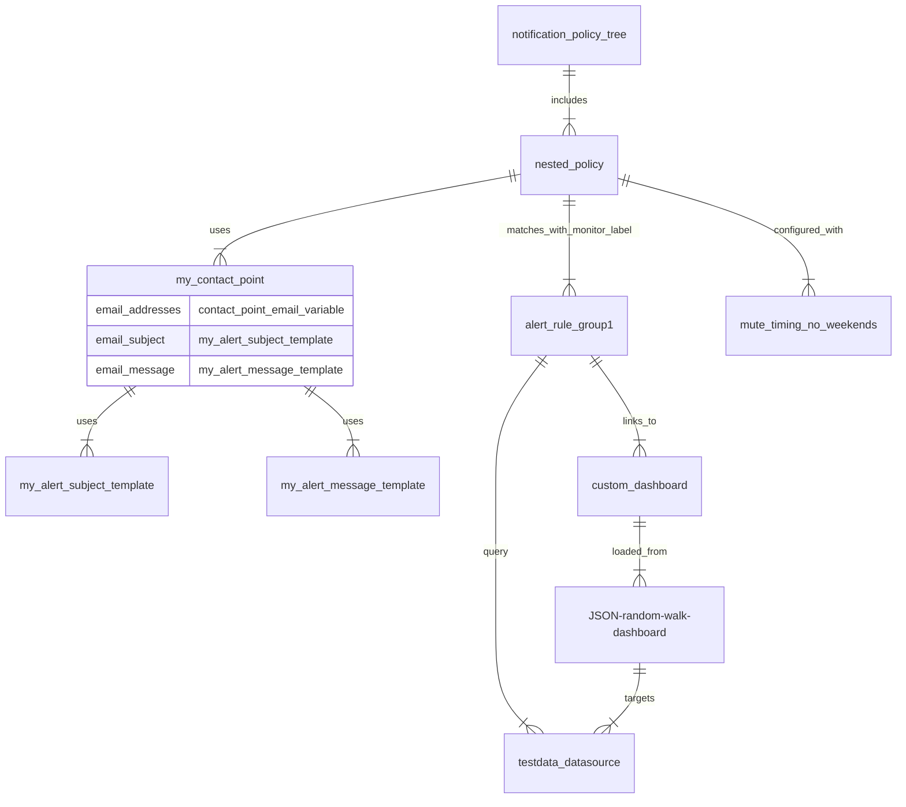

# Examples - Provision alerting resources in Grafana

This repository includes examples to [provision alerting resources](https://grafana.com/docs/grafana/latest/alerting/set-up/provision-alerting-resources/) using Docker Compose:

- [Provision alerting resources in Grafana OSS using YAML files and Docker Compose](./config-files/)
- [Provision alerting resources in Grafana OSS using Terraform and Docker Compose](./terraform/)

The mermaid diagram below illustrates the primary provisioned Grafana resources in these examples and their relationships.

