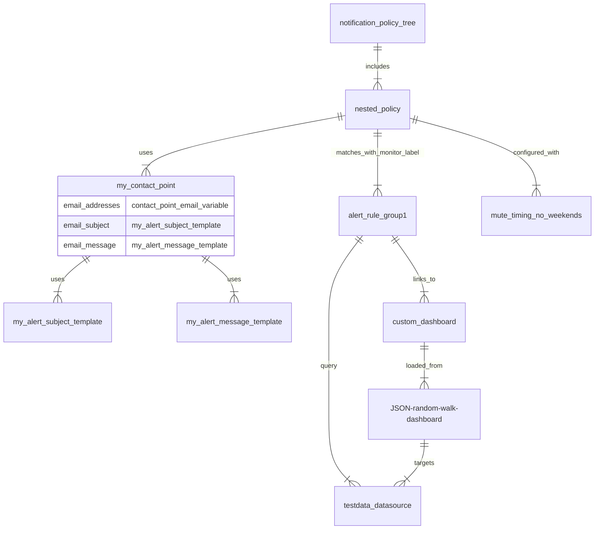

# Provision alerting resources in Grafana OSS using YAML files and Docker Compose

This example project showcases the setup of configuration files for provisioning Grafana alerting resources. For more detailed instructions, refer to the [Grafana Alerting documentation on using configuration files for provisioning](https://grafana.com/docs/grafana/next/alerting/set-up/provision-alerting-resources/file-provisioning/).

### Pre-requisites:
- [Docker Compose](https://docs.docker.com/compose/install/)

### Run the Grafana instance using Docker compose

To start Grafana, run the [docker-compose.yaml](./docker-compose.yaml) using the following command:


```bash
docker compose up -d
```

This command starts a Grafana instance and a local `smtp` container for sending emails.

```bash
 ✔ Container terraform-smtp-1     Running  0.0s
 ✔ Container terraform-grafana-1  Running  0.0s
```
> ⚠ ️Note that your email provider may refuse emails from the local `smtp` server.
> 
> To fix this, you can configure your own SMTP Relay options setting up the [Grafana `smtp` options](https://grafana.com/docs/grafana/latest/setup-grafana/configure-grafana/#smtp) in the [docker-compose.yaml](./docker-compose.yaml) or the [`smtp` docker container](https://github.com/ix-ai/smtp).


The provisioned configuration files of this example are available in the [`grafana/provisioning` folder](./grafana/provisioning/). The mermaid diagram below illustrates the primary provisioned Grafana resources in this project and their relationships.



After running the Docker compose setup, you can access the Grafana instance at [localhost:3000](http://localhost:3000) and verify the provisioned Grafana resources.


