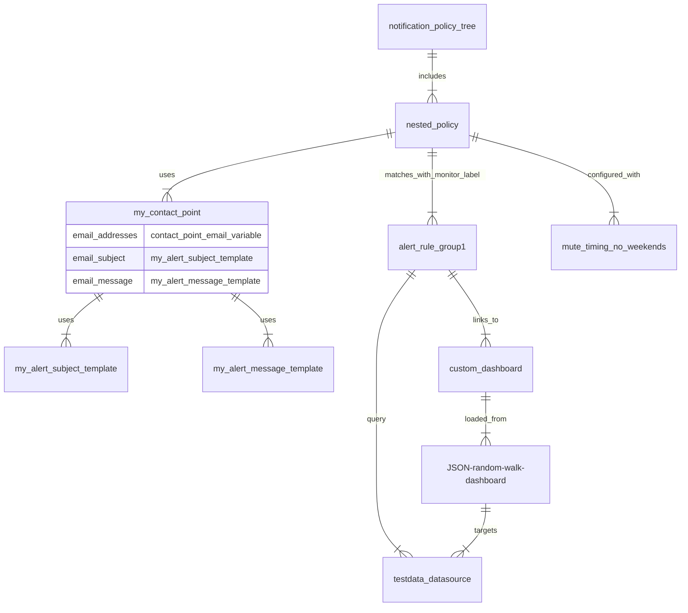
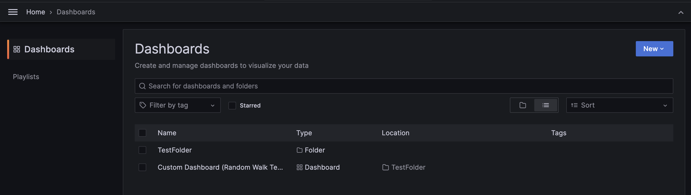
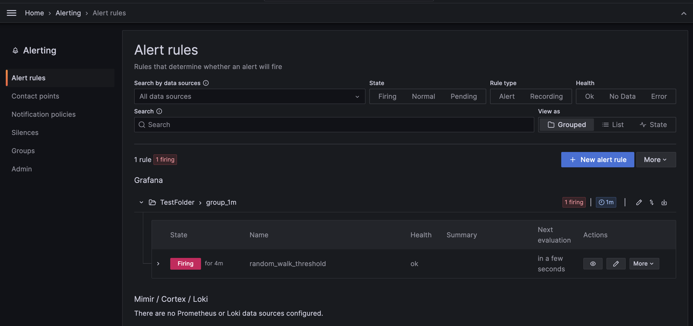
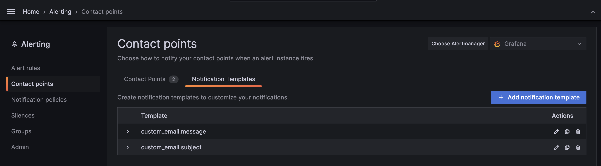
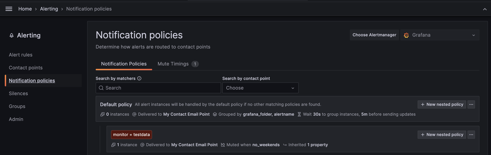

# Provision alerting resources in Grafana OSS using Terraform and Docker Compose

This is a demo project to demonstrate how to define and provision Grafana alerting resources with the [Grafana Terraform Provider](https://registry.terraform.io/providers/grafana/grafana/latest/docs). This example complements the [Grafana Alerting documentation](https://grafana.com/docs/grafana/latest/alerting/set-up/provision-alerting-resources/terraform-provisioning/).

### Pre-requisites:
- [Terraform](https://developer.hashicorp.com/terraform/install) 0.12 or higher.
- [Docker Compose](https://docs.docker.com/compose/install/)

### Run the Grafana instance using Docker compose

To start Grafana, run the [docker-compose.yaml](./docker-compose.yaml) using the following command:


```bash
docker compose up -d
```

This command starts a Grafana instance and a local `smtp` container for sending emails.

```bash
 ✔ Container terraform-smtp-1     Running  0.0s
 ✔ Container terraform-grafana-1  Running  0.0s
```
> ⚠ ️Note that your email provider may refuse emails from the local `smtp` server.
> 
> To fix this, you can configure your own SMTP Relay options setting up the [Grafana `smtp` options](https://grafana.com/docs/grafana/latest/setup-grafana/configure-grafana/#smtp) in the [docker-compose.yaml](./docker-compose.yaml) or the [`smtp` docker container](https://github.com/ix-ai/smtp).


After running the Docker compose setup, you can access the Grafana instance at [localhost:3000](http://localhost:3000). 

By default, the Grafana docker container comes without dashboards or alerting resources. Next, we'll provision our Grafana resources using Terraform.

### Provision Grafana resources with Terraform

The alerting resources of this example are defined as Terraform resources in the [`terraform-infra` folder](./terraform-infra/). The mermaid diagram below illustrates the primary provisioned Grafana resources in this project and their relationships.



To provision the Grafana resources, apply the Terraform configuration as follows:

1. Move to the directory containing the terraform configuration files.
	```bash
	cd terraform-infra
	```
1.  Define your custom variables in a `.tfvars` file by copying the `terraform.tfvars.example` file.
	```bash
	cp terraform.tfvars.example terraform.tfvars
	```
1. Edit the custom variables in `terraform.tfvars` with the email to sent notifications.
	```hcl
	contact_point_email  ="your_email@company.org"
	```

1. Initialize the working directory.
	```bash
	terraform init
	```

1. Apply the Terraform configuration files.
	```bash
	terraform apply
	```

Once the Terraform resources are added, you can visit [localhost:3000](http://localhost:3000) to verify the related Grafana resources.







